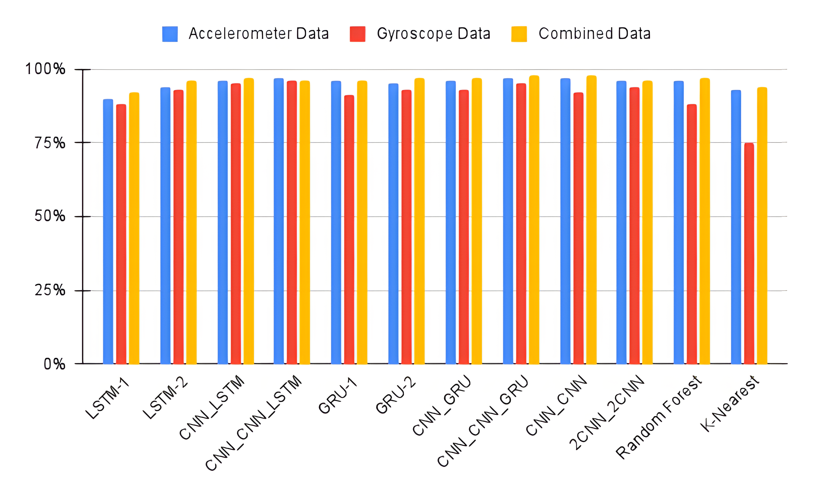
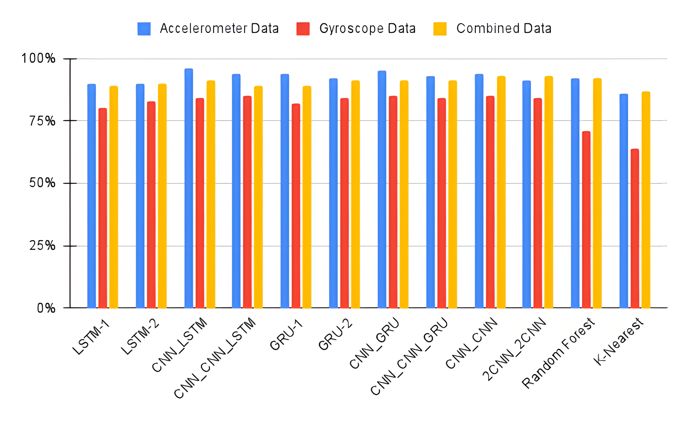
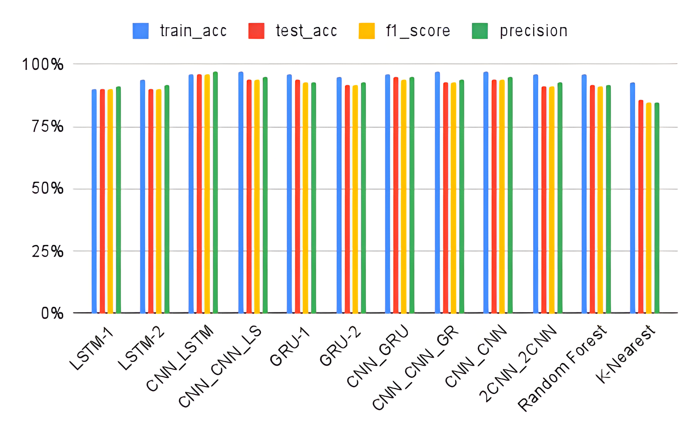

# Activiity Recognition Using Smartwatch Data

This is part of my diploma thesis, which I did as part of my studies as an 
Electrical and Computer Engineer at Aristotle University of Thessaloniki and can be found [here](https://ikee.lib.auth.gr/record/356521/?ln=en).

In this thesis, I explore the use of neural networks, as well as other classifiers, in human activity
recognition using data from smartwatches, in order to contribute to the improvement of the overall care for pancreatic 
cancer patients, for the [RELEVIUM](https://www.releviumproject.eu/) project of the Information Technologies Institute.


The tasks implemented in this project are:
1) Τhe accumulation of a complete dataset, covering the requirements of the problem to be solved. In our case, it was 
necessary to use data from smartwatches, describing simple physical activities of daily life. Therefore, the used datasets 
are the **DOMINO** dataset, the **PAMAP2** and the **WISDM**. 
2) The preprocessing of these data, in order to decrease their frequency, remove some undesired activities and 
create timeseries using the **sliding-windows** method. This step is crucial because the data are given in specific timestamps 
and therefore we can't shuffle them or discover any temporal dependencies.
3) Create and compile the desired models, in order to make predictions and test the efficiency our various data.


In order to run the files, you need to download the project, go to the desired folder and read the instructions there. You should 
run each file via terminal from its folder so as to not mess with the given paths. For example:
```azure
cd activity_recognition_using_smartwatch_data/domino_dataset/

python preprocess_dataset.py
```

Before running the files make sure you have all the necessary requirements, which can be found in the **requirements.txt** file.

### The Data
This is what your processed data should look like. Using the sliding windows method, with overlap, we split them to 
smaller timeseries, as shown below.


### The Models
I implemented three types of models depending on the type of data I use each time. I have models using **only accelerometer data**,
models using **only gyroscope data** and models using **both types of data**. Below I show the train and test results from my analysis, comparing the 
performances of the models for each type of data. It's clear that the accelerometer data are the ones with the highest results
on the test phase and are the ones I recommend using. The combined data have also high results and could
be considered a good alternative.

#### **Train results:**


#### **Test results:**


### Final Models
In the image below are shown the different metrics as they result from the analysis for the accelerometer data. This helps us choose the models which are the most
suitable for our needs and capture the best the patterns of our data. 

Those are the **GRU-2, CNN-LSTM, CNN-GRU, CNN-CNN-LSTM**, and **CNN-CNN-GRU** with train accuracy between **94-97%** and 
test accuracy between **93-95%**. The f1 score and precision
metrics have similar results varying between **93-96%** and **95-95%** accordingly.




