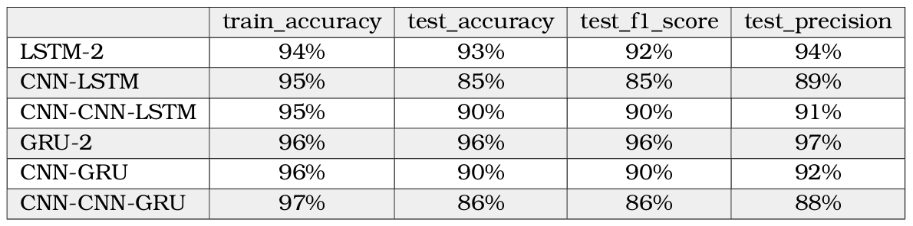

In this folder I implemented the **transfer learning** method. I pre-train the models using the domino dataset, and then I 
use two approaches: 
1) I apply the models directly to the data from the pamap2 dataset, in order to check how our models perform on new data
from other sensors (**apply_domino_models.py**).
2) I retrain the last layers of the models and then use the data from the pamap2 dataset, in order to fine-tune the models
and improve their performance. (**retrain_domino_models.py**).

### Important note
It's necessary to run the **preprocess_dataset.py** files found in the domino_dataset and pamap2_dataset folders in order to prepare the data
and then the **pretrain_domino_models.py** file to create and store the initial models. Then, depending on which
approach you choose, you run the corresponding file.

### Results
The results of the various models when applying the models directly to the data from the pamap2 dataset.

The results after retraining the last layers of the models and then use the data from the pamap2 dataset.

